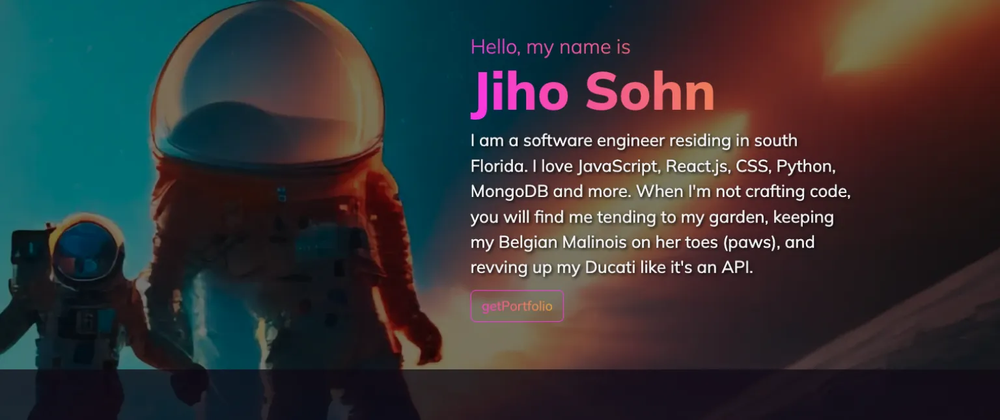

# Portfolio C10

A software engineer portfolio site with a futuristic Tokyo theme. Developed during Cohort 10 (C-10) as a class project utilizing React.js and Bootstrap 5.

 

## Website
* 👉 [jsohndata.com](https://jsohndata.com)

  

## Note
* There are 3 Pokemons--go find them!
* All background images are created by utilizing AI (Artificial Intelligence).

 

## Resource
* [Google Font: Mulish](https://fonts.google.com/specimen/Mulish)
* [cursor.cc](https://www.cursor.cc)
* [w3schools: CSS cusor](https://www.w3schools.com/cssref/tryit.php?filename=trycss_cursor)
* [icons8.com](https://icons8.com/)
* [vectorlogo.zone](https://vectorlogo.zone)